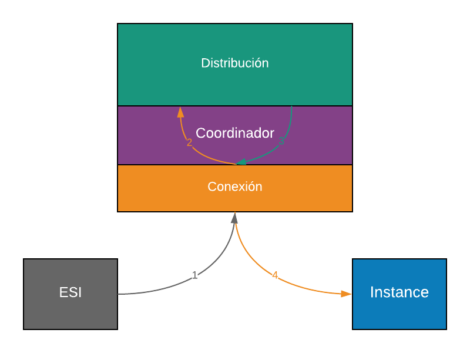
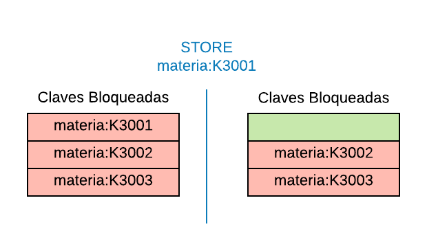

# Coordinador

El Coordinador de Re Distinto es el proceso encargado de distribuir los pedidos de información del Sistema.

Por un lado, tiene como obligaciones recibir las operaciones desde los ESIs, ejecutarlas en una de las Instancias de Re Distinto en base a cómo define el algoritmo de Distribución de su configuración y retornar un mensaje informando el resultado de ejecución. Por otro lado, es el encargado de gestionar las Instancias que están dentro del Sistema, permitiendo la conexión y desconexión de las mismas.

Para poder simular el paso del tiempo en la ejecución, cada vez que un ESI le pida ejecutar algo, la acción estará supeditada a un retardo ficticio dado por archivo de configuración.

## Inicialización

El Coordinador deberá ser el primero en iniciarse, y le proveerá a las distintas instancias la configuración de tamaños de la cantidad y el tamaño de las entradas. En primera instancia, leerá su archivo de configuración e inicializará todas las estructuras administrativas que requerirá para la gestión del sistema. Una vez realizado el proceso de inicialización, quedará a la espera de solicitudes de conexión ya sea de Instancias de Re Distinto o de procesos ESI(^5). Por cada una de las conexiones que sean aceptadas, el Coordinador lanzará un Hilo encargado de atender la conexión.

## Ejecución

El Coordinador recibirá desde los procesos ESI solicitudes. Además, por cada solicitudes recibida, se almacenará información que permite registrar la ejecución que se dio en el sistema. Dicha información se guardará en un archivo conocido como log de operaciones.

### Log de Operaciones

| ESI     | Operación                       |
|---------|---------------------------------|
| `ESI 1` | `SET materias:K3001 Fisica 2` |
| `ESI 1` | `STORE materias:K3001`          |
| `ESI 2` | `SET materias:K3002 Economia` |

## Interacción con ESI e Instancia

1. El Coordinador recibe una solicitud proveniente de un proceso ESI.
2. El Coordinador procesa la solicitud con el fin de determinar la Instancia a la que se le asignará la solicitud(^6).
3. Se elige la Instancia asociada y se le envía la solicitud.
4. La instancia retorna al Coordinador
5. El Coordinador logea la respuesta y envía al ESI

En el caso que el coordinador decida en el paso 2 que la operación no puede ser ejecutada porque la instancia no existe más en el sistema, o porque el recurso al que intenta acceder se encuentra tomado(^7), le avisará al Planificador. El Planificador encolará el ESI en cuestión en una cola de bloqueados; en ambos casos haciendo referencia al recurso que se intentó bloquear.

Es importante destacar que la operación GET no genera ningún registro dentro de la instancia, si no que solo modifica el estado de bloqueos y desbloqueos en el planificador. Es el SET el encargado de alterar el valor y crear la clave, si esta no existe.

## Bloqueos

El sistema de Re Distinto aplica bloqueos sobre claves utilizadas. Es decir, a medida que un ESI solicita una operación de GET sobre una clave específica, esta pasa a estar “tomada” y no puede ser tomada (GET) por ningún ESI hasta que se libere (STORE).

Para lograr este comportamiento, el **Planificador** lleva un registro de qué claves fueron bloqueadas por cada `ESI` en particular. Las cuales deberá liberar en cuanto reciba una operación `STORE` con dicha clave por parte de la `ESI` bloqueadora(^8). Esta liberación será de manera **FIFO**; el primer ESI que se encontraba bloqueado esperando esta clave será liberada _(Esto no quiere decir que será inmediatamente tomado por este ESI; sino que estará disponible para ser planificado; y deberá re ejecutar la operación de `GET` al ser ejecutado)_(^9).

Cabe aclarar que la finalización de un ESI libera los recursos que este tenía tomados.

## Configuración

| Campo                           | Tipo                | Ejemplo |
|---------------------------------|---------------------|---------|
| Puerto de Escucha de conexiones | [numérico]          | `8000`  |
| Algoritmo de Distribución       | `LSU` / `EL` / `KE` | `EL`    |
| Cantidad de Entradas            | [numérico]          | `20`    |
| Tamaño de Entrada (en bytes)    | [numérico]          | `100`   |
| Retardo (en milisegundos)       | [numérico]          | `300`   |

## Ejemplos

**GET de recurso disponible:**

1. El planificador envía la señal de ejecutar al ESI1
2. El ESI1 envía al coordinador la orden de bloquear la clave XX (GET XX)
3. El Coordinador colabora con el Planificador avisando de este recurso
4. El Planificador lleva cuenta que la clave XX está tomada por ESI1

**GET de un recurso tomado:**

1. _(partiendo de la situación anterior)_
2. El planificador envía la señal de ejecutar al ESI2
3. El ESI2 envía al coordinador la orden de bloquear la clave XX (GET XX)
4. El Coordinador colabora con el Planificador avisando de este recurso
5. El Planificador responde que esta clave se encuentra tomada, y toma nota que el ESI2 se encuentra bloqueado esperándola.

---

^5: Para poder distinguir qué proceso se está conectado, intercambiará mensajes con el proceso (este procedimiento se conoce como handshaking).

^6: Recordar que en el caso de ser un GET no se necesita acceder a ninguna instancia. Si corresponde, utilizará su algoritmo de distribución.

^7: Esta información la obtiene al interactuar con el planificador para actualizar el estado en este último.

^8: Es importante tener en cuenta esto a la hora de implementar el comando "deadlock" de la consola del planificador

^9: Si un ESI realiza un GET y esta operación lo bloquea, esa sentencia debe ser considerada al calcular la ráfaga ejecutada. Al desbloquearse y ejecutar nuevamente la operación, volverá a ser considerada para totalizar la ráfaga.
