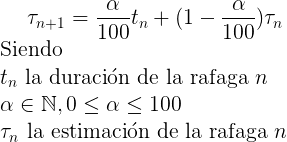

# Planificador

Es el proceso encargado de orquestar la ejecución de los procesos ESI. Los procesos ESI llegarán a una cola de listos, donde se los planificará para su próxima ejecución según un algoritmo predeterminado por archivo de configuración.

A razón de simplificar el desarrollo, la ejecución de cada línea de código _del script a ser interpretado por el ESI_ **será atómica** y cada vez que una instrucción sea ejecutada se le informará al planificador. En este sentido el Planificador actúa como un Clock del sistema. No se deberá re-planificar los ESI a seguir ejecutando al recibir la confirmación de sentencia ejecutada.

En caso de que un proceso ESI no pueda seguir ejecutando debido a un bloqueo, deberá ser enviado a la cola de proceso bloqueados, esperando a que quien bloqueó la key utilice un _store_ y libere la misma.

Por otro lado, en el caso de que el ESI haga una operación de GET sobre un recurso libre, no deberá moverse del estado de ejecución ni ser re-planificado.

Una vez finalizado el proceso ESI, se lo enviará a una cola de _finalizados_.

Es importante destacar que cada proceso ESI deberá tener un identificador dentro del sistema.

## Algoritmos de Planificación

La ejecución de las instrucciones de cada ESI estará dividida en ráfagas de CPU y ráfagas de bloqueo. Dado que no podemos predecir con certeza la duración de cada ráfaga, el planificador será responsable de realizar las estimaciones correspondientes, cuando sea necesario. La unidad a utilizar será "sentencias" en lugar de tiempo, por cuestiones de simplicidad.

A partir de estas estimaciones, el planificador podrá utilizar los siguientes algoritmos, los cuales deberán poder ser modificados, junto con sus parámetros, mediante el archivo de configuración al momento de inicializar el planificador:

1. _Shortest Job First:_ se dará prioridad al ESI cuya próxima ráfaga sea la más corta. Deberá soportar los modos con y sin desalojo.
2. _Highest Response Ratio Next:_ se dará prioridad al ESI cuyo response ratio sea el más alto.

En ambos algoritmos se desconoce la próxima ráfaga, por lo que será estimada utilizando la fórmula de la media exponencial. La formula para esta estimación será la siguiente:

La estimación inicial de todos los ESI será la misma, y deberá poder ser modificable por archivo de configuración.

## Consola del planificador

Mediante una consola, el planificador deberá facilitar al usuario las siguientes operaciones:

* Pausar/Continuar planificación[^2]: El Planificador no le dará nuevas órdenes de ejecución a ningún ESI mientras se encuentre pausado.
* bloquear <clave> <ID>: Se bloqueará el proceso ESI hasta ser desbloqueado _(ver más adelante)_, especificado por dicho <ID>[^3] en la cola del recurso <clave>. _Vale recordar que cada línea del script a ejecutar es atómica, y no podrá ser interrumpida; si no que se bloqueará en la próxima oportunidad posible. Solo se podrán bloquear de esta manera ESIs que estén en el estado de listo o ejecutando._
* desbloquear <clave>: Se desbloqueara el primer proceso ESI bloquedo por la <clave> especificada. Solo se bloqueará ESIs que fueron bloqueados con la consola. _Si un ESI está bloqueado esperando un recurso, no podrá ser desbloqueado de esta forma._
* listar <recurso>: Lista los procesos encolados esperando al recurso.
* kill <ID>: finaliza el proceso. Recordando la atomicidad mencionada en “bloquear”.
* status <clave>: Debido a que para la correcta coordinación de las sentencias de acuerdo a los algoritmos de distribución[^4] se requiere de cierta información sobre las instancias del sistema.
* deadlock: Esta consola también permitirá analizar los deadlocks que existan en el sistema y a que ESI están asociados. Pudiendo resolverlos manualmente con la sentencia de kill previamente descrita.

## Configuración

| Campo                             | Tipo                         | Ejemplo                          |
|-----------------------------------|------------------------------|----------------------------------|
| Puerto de Escucha de conexiones   | [numérico]                   | `8000`                           |
| Algoritmo de planificación        | `SJF-CD` / `SJF-SD` / `HRRN` | `HRRN`                           |
| Alfa planificación                | [numérico entre 0 y 100]     | `30`                             |
| Estimación inicial                | [numérico]                   | `5`                              |
| IP de Conexión al Coordinador     | [cadena]                     | `"127.0.0.1"`                    |
| Puerto de Conexión al Coordinador | [numérico]                   | `8000`                           |
| Claves inicialmente bloqueadas    | [Lista de claves]            | `materias:K3002, materias:K3001` |

---
[^2] Esto se puede lograr ejecutando una sycall bloqueante que espere la entrada de un humano.
[^3] El Planificador empezará con una serie de claves bloqueadas de esta manera.
[^4] Estos algoritmos se detallarán más adelante.
